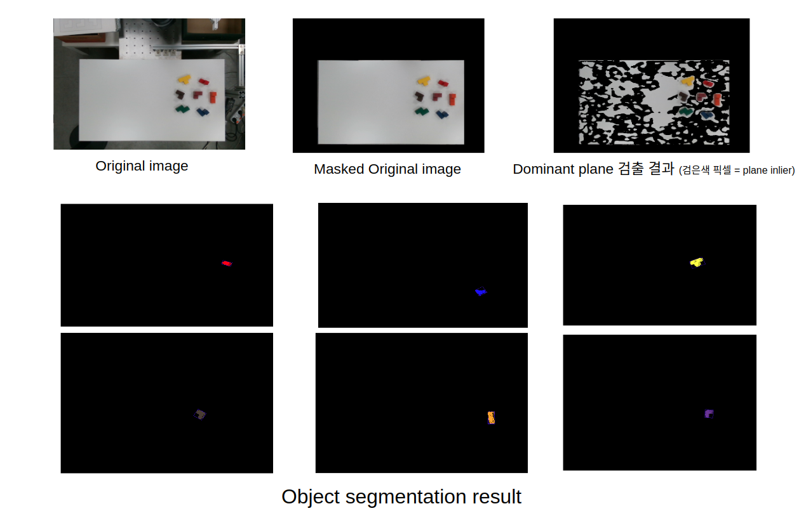

# Object Pose Estimation of Block 

This repository was developed for robotic manipulation operation testing.
This code has been tested under Ubuntu 16.04 and ROS Kinetic. Please remember that this is on-going code which is subject to changes in the future.

**Authors**: Taewoo Kim(KAIST visual Intelligence Lab.)

**Contact information:** intelpro@kaist.ac.kr

## Dependencies

#### C++11 or C++0x Compiler

#### Realsense-ros wrapper

https://github.com/IntelRealSense/realsense-ros/releases

#### Point Cloud Library - 1.7

http://pointclouds.org/

#### OpenCV - 3.3.1

https://www.learnopencv.com/install-opencv-3-4-4-on-ubuntu-16-04/

## Installation & Build

$ cd ~/catkin_ws

$ git clone https://github.com/intelpro/Block-Pose-Estimation

$ source ./devel/setup.bash 

$ catkin_make DCMAKE\_BUILD\_TYPE=Release

## Running Block Pose Node

You will need to provide a settings file. See the excution examples below.

$ rosrun block_pose block_pose PATH_TO_SETTINGS_FILE

$ sh.run.sh

## Rostopic publish message

Our code publish Blue, Brown, Green, Orange, Purple, Red, Yellow block information. Block information rostopic contain frame id, unit occupancy grid, unit grid shape, 3D bounding box vertex, block center point.

How can I check the ros topic?

$ rostopic echo /block_info/red 

You can check the published topics by typing "rostopic list" in terminal.

Published ROS Topic information  

 - Frame_id: Frame information 
 - Object_id: Object identification
 - Grid_size: Unit grid size of block(order of x,y,z), each unit grid side length is 2.5cm
 - Occupancy_Grid: This topic means occupancy of unit grid.  1 means occupied, 0 means unoccupied.
 - BB_points: 3D bounding box vertex. Each 3D point has measure in camera coordinate system. This message is published in gemotry\_msgs::Points type.
 - Block\_center\_Points: Center 3D position in camera coordinate system. Each point is published in geometry\_msg::Points type

## Demo picture

